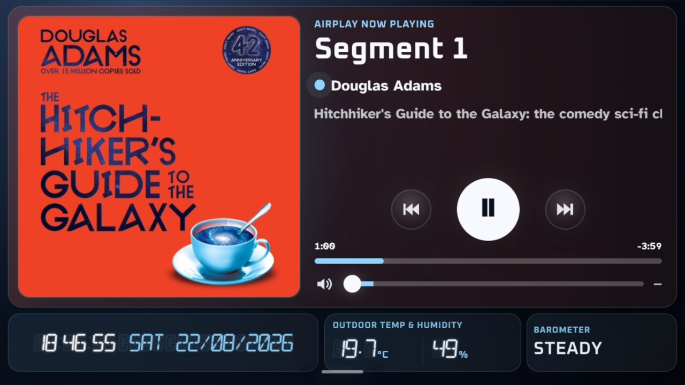

# A Clockwork Plex

**A Clockwork Plex** turns a Raspberry Pi into a bedside touchscreen music appliance: clock, weather station, Plexamp, NFC albums, AirPlay, proper scheduled alarms and a guarded three-band CamillaDSP equaliser, all living together without requiring you to become the household systemd administrator. 🎵⏰

The project is built as **one appliance**. The installer owns the pieces and their relationships — Plexamp, Node, NFC, AirPlay, dashboard/kiosk integration, alarm-safe audio routing and EQ — so a fresh installation is not a scavenger hunt through fifteen unrelated shell scripts.

## Quick start

For a fresh Raspberry Pi, follow **[`docs/INSTALL.md`](docs/INSTALL.md)**. The normal supported source channel is the repository's default **`main`** branch, and the normal appliance installation command is:

```bash
cd ~
git clone https://github.com/AndyBettger/A-Clockwork-Plex.git
cd A-Clockwork-Plex
bash setup.sh
```

Run setup as the normal appliance user, **not** with `sudo`. `setup.sh` acquires and verifies the pinned CamillaDSP artifact, runs the guarded appliance installer and handles the first Plexamp claim hand-off when required.

Published GitHub release tags are immutable source snapshots. For example, release **`v0.4.0`** identifies the source corresponding to A Clockwork Plex 0.4.0; use a release tag when you need a reproducible historical build rather than the moving `main` channel.

There is a much larger engineering history in the repository, but you do not need to read it before breakfast. The friendly documentation map is **[`docs/README.md`](docs/README.md)**; development material and historical archaeology have their own homes underneath `docs/`.

## Validated hardware

The physically validated appliance uses:

- Raspberry Pi 4B;
- 64-bit Raspberry Pi OS with Desktop;
- Raspberry Pi Touch Display 2, rotated left for landscape use;
- Raspberry Pi DAC Pro, exposed by ALSA as `CARD=Pro`;
- PN532 NFC reader on I2C bus 1 at address `0x24`;
- network access for package installation and the pinned Plexamp, Node and CamillaDSP downloads.

A Clockwork Plex does not perform `rpi-update`, experimental bootloader changes or HAT firmware updates. A bedside clock should wake you up, not unexpectedly volunteer to become a firmware research project.

## What you get

### Clock

The main bedside screen provides:

- large shared segmented time and date;
- selectable 12/24-hour presentation;
- configurable live-weather cards;
- an alarm-set annunciator driven by the scheduler's real next occurrence;
- **Next alarm within 12 hours** or **Any future alarm** annunciator modes;
- scheduled night dimming, Classic and Astronomy night presentation, touch-to-wake and burn-in shifting.

<table>
<tr>
<td width="50%"></td>
<td width="50%"></td>
</tr>
<tr>
<td align="center"><sub>Daytime Clock with live weather cards</sub></td>
<td align="center"><sub>Classic night presentation</sub></td>
</tr>
</table>

### Weather

Forecast and live observations are deliberately separate:

- **Open-Meteo** supplies cached forecast data;
- **Ecowitt Push** or **Weather Underground PWS** can supply current outdoor observations;
- WU can also supply cached historical rainfall and Rainy Day Fund totals.

The selected live provider remains authoritative for outdoor conditions. When WU is selected, an appliance that also receives Ecowitt uploads may use **fresh supplementary indoor temperature/humidity** without allowing Ecowitt to overwrite the WU outdoor readings.

Where WU does not directly provide the same rain fields, A Clockwork Plex derives **rolling Hourly rain, Event rain** and the current day's maximum observed gust while still giving native provider values precedence when they exist.

WU API keys are managed as write-only secret material outside public configuration. Enter them through **Settings → Weather** rather than putting them into `config.json`, shell history or a sticky note attached to the Pi. The Pi cannot keep a secret if we write it on its forehead. 😄

<table>
<tr>
<td width="50%"></td>
<td width="50%"></td>
</tr>
<tr>
<td align="center"><sub>Open-Meteo forecast outlook</sub></td>
<td align="center"><sub>Live indoor and outdoor observations</sub></td>
</tr>
</table>

### Plexamp and NFC

Plexamp Headless remains the music player for this release. The installer pins and manages its compatible Node runtime without replacing Raspberry Pi OS's own Node installation.

The NFC listener uses the validated PN532 reader. Compatible album tags can start Plexamp playback and bring the Plexamp surface to the front, which is considerably more satisfying than navigating a music library before your eyes have properly opened.


### AirPlay

Shairport Sync provides AirPlay through the same appliance-managed music path as Plexamp. PlaybackCoordinator handles Plexamp/AirPlay ownership and hand-off without routinely stopping and restarting the audio services.

The receiver name is configurable from Settings and applied through a restricted helper with validation and rollback. Current integration and troubleshooting details live in [`docs/development/architecture/airplay-metadata.md`](docs/development/architecture/airplay-metadata.md).

<table>
<tr>
<td width="50%"></td>
<td width="50%"></td>
</tr>
<tr>
<td align="center"><sub>AirPlay route ready</sub></td>
<td align="center"><sub>AirPlay Now Playing</sub></td>
</tr>
</table>

### Scheduled alarms

A Clockwork Plex supports multiple recurring alarms with:

- **real clock-triggered playback**;
- Snooze and repeated ring cycles;
- deliberate Dismiss;
- configurable tone, target volume, fade-start volume and fade duration;
- **automatic takeover from Plexamp/AirPlay while the alarm owns priority**;
- a separate **Maximum Alarm Volume** safety ceiling.

Scheduled alarms **bypass Music Master and music EQ**. That means turning the music down at bedtime does not silently turn tomorrow morning's alarm down with it, while Maximum Alarm Volume still prevents the alarm lane from attempting to introduce itself to the neighbours.


## Audio and equaliser

The accepted EQ appliance separates music gain from alarm loudness:

```text
Plexamp ----\
             +-> source trims -> Music Master -> fixed -6.5 dB reserve
AirPlay ----/                                  -> Bass/Mid/Treble
                                                -> music bus ---------\
                                                                       +-> final limiter -> DAC
Alarm -> start/target/fade -> Maximum Alarm Volume ---------------------/
```

So:

- Plexamp and AirPlay follow Music Master and the three-band EQ;
- scheduled alarms bypass the music controls and join afterwards;
- Maximum Alarm Volume limits alarms independently;
- the final limiter remains in front of the DAC for both lanes.

**CamillaDSP is pinned to the accepted 4.1.3 build** and managed by `a-clockwork-plex-camilladsp.service`. The supported audio lifecycle lives under `scripts/audio/`; normal installation still goes through `setup.sh` rather than invoking component tools by hand.

## Settings

**The touchscreen Settings workspace covers**:

- General appliance preferences;
- Display/Clock behaviour and night presentation;
- Weather sources, units, forecast and WU credentials;
- alarms and alarm defaults;
- **AirPlay receiver naming**;
- **Music Master, source trims, Maximum Alarm Volume and EQ**;
- Plexamp and Advanced diagnostics;
- About/status information.

Ordinary configuration belongs in Settings rather than hand-editing `config.json`. It is both easier and much less likely to create a 2 a.m. debugging hobby.

The installation guide includes a compact **[visual first-use tour](docs/INSTALL.md#8-visual-first-use-tour)** showing the Weather, Audio and Alarm Settings surfaces and the normal day/night operating views.

## Updating an installed appliance

The normal supported update channel is `main`:

```bash
cd ~/A-Clockwork-Plex
git status
git switch main
git pull --ff-only
bash setup.sh
```

If `git status` shows unexpected tracked changes, investigate them before pulling rather than forcing the checkout. `setup.sh` is convergent: completed stages are checked and reused, while any required reboot or local Plexamp commissioning checkpoint is reported explicitly.

A checkout intentionally pinned to a release tag is an immutable snapshot and should not be treated like a moving branch. To move a tag-pinned appliance to another release, explicitly choose that newer published release/tag and follow its update notes rather than blindly pulling through history.

## Useful diagnostics

The dashboard listens locally on port `8088`. Supported verifier/diagnostic tooling includes:

```bash
bash scripts/verify-fresh-bootstrap.sh
bash scripts/verify-appliance.sh
bash scripts/audio/verify-audio.sh
```

For service-level diagnosis:

```bash
systemctl status a-clockwork-plex.service --no-pager -l
systemctl status plexamp.service --no-pager -l
systemctl status nfc-listener.service --no-pager -l
systemctl status shairport-sync.service --no-pager -l
systemctl status a-clockwork-plex-camilladsp.service --no-pager -l
```

Retained script purpose and safety are catalogued in [`scripts/README.md`](scripts/README.md). A script appearing in that catalogue is not necessarily an invitation to run it; some are the plumbing, and plumbing is happiest when nobody randomly turns valves for sport.

## Development

The normal local validation path is:

```bash
bash scripts/run-tests.sh
```

That runner discovers current Python, shell and dashboard JavaScript sources, performs syntax/compile checks and runs the complete unit suite. See [`docs/development/testing/testing.md`](docs/development/testing/testing.md) for the local/CI relationship and [`docs/appliance-installer.md`](docs/appliance-installer.md) for the lower-level guarded installer interface.

For contributors and future debugging, [`docs/README.md`](docs/README.md) separates normal-user documentation, the live roadmap, current engineering material and archived history.

## Release identity

A Clockwork Plex 0.4.0 uses the release identity **`v0.4.0` — Unified Bedside Appliance**. Settings → About reads the same maintained identity from `app/static/app-version.json`.

`main` is the normal supported install/update channel. Published GitHub tags/releases provide immutable version snapshots, while development state, release evidence and future work remain in [`docs/roadmap/ROADMAP.md`](docs/roadmap/ROADMAP.md) rather than leaking into the user-facing appliance version.
