# A Clockwork Plex — installation

This is the normal end-to-end installation path for a new A Clockwork Plex appliance. It starts with a blank SD card and ends with the dashboard, Plexamp Headless, NFC, AirPlay, alarm-safe audio and the guarded three-band CamillaDSP equaliser installed as one appliance.

The engineering acceptance runbooks under `docs/` contain deeper verification and rollback evidence. **A normal installation does not require running those acceptance tests or plan-only passes.** If setup reports an unexplained failure, stop at that failed stage rather than continuing with unrelated manual fixes.

The normal supported source channel is the repository's default **`main`** branch. Published GitHub release tags are immutable source snapshots; for this release, **`v0.4.0`** identifies A Clockwork Plex 0.4.0. Use `main` for the normal supported install/update path, or deliberately select a published tag when you need an exact reproducible release snapshot.

## 1. Hardware used by the validated appliance

The current physically validated target is:

- Raspberry Pi 4B;
- 64-bit Raspberry Pi OS with Desktop;
- Raspberry Pi Touch Display 2 (720×1280 native, rotated left for landscape use on the validated appliance);
- Raspberry Pi DAC Pro, expected by ALSA as `CARD=Pro`;
- PN532 NFC hardware configured for I2C, expected on bus 1 at address `0x24`;
- network access for package installation and the pinned Plexamp/Node/CamillaDSP downloads.

Connect HATs and internal hardware with the Pi powered off. Do not run `rpi-update`, change Pi bootloader release channels, write HAT EEPROMs or perform other experimental/pre-release firmware updates as part of an A Clockwork Plex installation.

## 2. Install and prepare Raspberry Pi OS

Use Raspberry Pi Imager and select the current **64-bit Raspberry Pi OS with Desktop** image.

In Imager's OS customisation, set the normal appliance values before writing the card:

- hostname, for example `a-clockwork-plex`;
- username and password;
- Wi-Fi SSID/password and Wi-Fi country if Wi-Fi is used, or use wired Ethernet;
- locale, keyboard and timezone;
- enable SSH if you want to install/administer the appliance remotely.

Write the image and allow Raspberry Pi Imager to verify it. On first boot, let Raspberry Pi OS finish its first-boot setup and reach the desktop. The dashboard kiosk starts inside the logged-in desktop session, so enable **desktop auto-login** for the appliance user if the OS image has not already done so.

### Update the fresh OS first

A Clockwork Plex deliberately does **not** perform a blanket Raspberry Pi OS upgrade. On a newly imaged Pi, apply the normal supported OS updates before installing the appliance:

```bash
sudo apt update
sudo apt full-upgrade
sudo reboot
```

Do not use `rpi-update` for this.

### Raspberry Pi Touch Display 2 setup

The validated 7-inch Raspberry Pi Touch Display 2 is a **720×1280 native portrait panel**. A Clockwork Plex uses it physically in landscape, so configure the desktop before installing the kiosk.

#### Rotate the display to landscape

1. Open **Preferences → Control Centre → Screens**.
2. Right-click the rectangle representing the Touch Display 2 (normally `DSI-1`).
3. Choose **Orientation → Left**.
4. Select **Apply**, then **OK** to keep the change.

If deciding which way is "Left" starts turning into a matrix transformation in your head, the approved low-computation method is to tip the actual device onto its left side first and see whether the picture ends up the right way round. Bonus internet points are available for avoiding unnecessary linear algebra. 😁

Do not change the panel to a made-up 1280×720 resolution: its native mode remains **720×1280**; orientation is what makes it landscape on the desk.

#### Set screen scaling to 1.5×

1. Stay in **Preferences → Control Centre → Screens**.
2. Right-click the Touch Display 2 / `DSI-1` rectangle.
3. Choose **Scaling → 1.5**.
4. Select **Apply**, then **OK**.

#### Set touchscreen mode to Multitouch — required

**This is required for A Clockwork Plex to work correctly as a touchscreen appliance.** Mouse-emulation mode can register taps, but it does not provide the native touch-and-drag behaviour required for scrolling the Weather page and Plexamp.

1. Stay in **Preferences → Control Centre → Screens**.
2. Right-click the Touch Display 2 / `DSI-1` rectangle.
3. Choose **Touchscreen → Mode → Multitouch**.
4. Select **Apply**, then **OK** if prompted.

Do not leave the Touch Display 2 in mouse-emulation mode for normal A Clockwork Plex use.

#### Set desktop size and appearance

1. Open **Preferences → Control Centre → General**.
2. Under **Defaults**, choose **Medium** rather than Small or Large.
3. Select the **Dark** appearance/theme if you want the same desktop appearance used during physical validation.

### Enable VNC for commissioning

VNC is strongly recommended during initial setup. It makes Plex sign-in, password-manager credentials, Weather Underground station IDs/API keys and other long values much easier to enter by copy/paste from a full-size computer.

1. Open **Preferences → Control Centre → Interfaces**.
2. Enable **VNC**.
3. Connect from another computer with a compatible VNC client whenever a full keyboard/mouse is useful.

VNC is an administration convenience; A Clockwork Plex does not require it for normal bedside operation.

### Chromium commissioning tweak

Before kiosk installation, give ordinary Chromium windows a little more usable space on the Touch Display 2:

1. Open Chromium.
2. Open **Settings → Appearance**.
3. Turn **Use system title bar and borders** **off**.

Kiosk mode overrides ordinary browser chrome, but this makes Chromium roomier while commissioning Plexamp and the appliance.

Do not manually install Plexamp, Node, Shairport Sync, CamillaDSP, NFC Python libraries, ALSA routes, DAC overlays or A Clockwork Plex services; setup owns those components.

## 3. Obtain A Clockwork Plex

Open a terminal on the Pi or connect over SSH/VNC. Raspberry Pi OS with Desktop normally provides the required download tools; if `git` or `curl` is missing, install only those bootstrap tools first:

```bash
sudo apt update
sudo apt install -y git curl
```

Clone the normal supported `main` channel:

```bash
cd ~
git clone https://github.com/AndyBettger/A-Clockwork-Plex.git
cd A-Clockwork-Plex
git switch main
```

For an exact published release snapshot instead, fetch the published tags and explicitly select the required one, for example:

```bash
git fetch --tags
git switch --detach v0.4.0
```

A tag checkout is intentionally detached and immutable; that is useful for reproducibility, but it is not the normal moving update channel.

Do not create a Python virtual environment or install `requirements.txt` manually. Appliance setup owns the verified application and NFC environments.

## 4. Install the appliance

For the normal physically validated installation, run one command as the normal appliance user, **not** with `sudo`:

```bash
cd ~/A-Clockwork-Plex
bash setup.sh
```

`setup.sh` is the user-facing setup entry point. It automatically:

- acquires and verifies the pinned CamillaDSP 4.1.3 artifact for the EQ profile;
- invokes the guarded fresh-appliance installer with the accepted EQ profile;
- installs the package/application and NFC Python environments;
- commissions the Pi hardware/I2C/DAC path;
- installs the pinned Plexamp Headless and Node runtime;
- installs NFC, dashboard/kiosk, alarm-safe audio, EQ, AirPlay and restricted helpers;
- runs the installer's final appliance verification.

There is no CamillaDSP session variable to copy or preserve between commands.

### If setup asks for a reboot

Hardware commissioning may deliberately stop with:

```text
ROOT_INSTALL=REBOOT-REQUIRED
REBOOT_POLICY=OPERATOR-CONTROLLED
```

Run:

```bash
sudo reboot
```

After the Pi returns:

```bash
cd ~/A-Clockwork-Plex
bash setup.sh
```

Completed idempotent stages are checked and reused.

### If Plexamp Headless needs claiming

A new player has no Plex account claim state. When the guarded installer reaches that point, interactive `setup.sh` automatically launches the installed Plexamp Headless process for you; there is no separate claim command to copy and run.

1. On another device, open `https://plex.tv/claim` and obtain a fresh claim code.
2. Enter the code into the Plexamp prompt shown by setup.
3. Enter the player name when requested.
4. Wait for Plexamp to report that it has started successfully.
5. Press `Ctrl-C` once.

`setup.sh` checks that Plexamp saved its claim state and then resumes the guarded appliance installation automatically. The claim code is entered directly into Plexamp and is never accepted as a setup argument, environment variable or repository value.

### Successful completion

The underlying guarded installer should finish with:

```text
ROOT_INSTALL=COMMITTED
INSTALL_ROUTE=fresh-bootstrap
PACKAGE_VENV_BASELINE=RETAINED
APPLICATION_VERIFY=PASS
```

An unexplained non-zero exit is not a cue to install components manually. Stop there and diagnose the failed owner.

## 5. Reboot into the appliance

After setup commits successfully, reboot once:

```bash
sudo reboot
```

After desktop auto-login, the A Clockwork Plex kiosk should start automatically and display the dashboard. The local dashboard is served on port `8088`.

## 6. Finish Plexamp commissioning

Claiming Plexamp Headless from the command line establishes the headless player, but the first browser visit still needs ordinary Plexamp commissioning.

Open the Plexamp surface and:

1. sign into your Plex account if prompted;
2. select the Plex music library you want this appliance to use;
3. open Plexamp's audio-output settings;
4. select **`A Clockwork Plex - Plexamp`** as the audio output.

Do **not** leave Plexamp on its default **`Follows system output`** choice. The dedicated **A Clockwork Plex - Plexamp** output routes Plexamp through the appliance-managed Music Master/EQ audio path.

This is one of the places where VNC is especially useful. A long random password from a password manager is exactly what you should be using and exactly what nobody wants to peck into a 7-inch touchscreen one character at a time. Copy/paste it from the VNC-connected computer instead.

## 7. First-time A Clockwork Plex configuration

Use **Settings** in the dashboard for ordinary appliance configuration rather than editing `config.json` directly. Typical first-time setup includes:

- **General:** appliance name and time/display preferences;
- **Display:** brightness, night behaviour and presentation;
- **Audio:** Music Master, source trims, Maximum Alarm Volume and EQ preferences;
- **AirPlay:** receiver name;
- **Alarms:** alarm definitions and the explicit scheduled-alarm sound safety controls;
- **Weather:** station/location details, units, forecast preferences and observation source.

For Ecowitt Push, point the station's custom-upload destination at the appliance's `/ecowitt` endpoint using the Pi's LAN address/hostname.

On the validated Ecowitt setup, the station provides one custom-upload destination at a time. That makes direct Ecowitt Push ideal for the A Clockwork Plex appliance where local-only readings such as indoor temperature/humidity matter most, but it is not a practical way to feed several A Clockwork Plex appliances from the same station simultaneously. For multiple appliances, Weather Underground is the better shared live-observation source because each appliance can poll the same cloud-hosted PWS independently. An appliance that is also the Ecowitt custom-upload destination may additionally use fresh indoor readings when that feature is available.

Weather Underground can be selected and commissioned from **Settings → Weather**. Its API key remains write-only managed secret material and should be entered through the Settings credential controls, never into `config.json`, shell history or repository files. VNC is very convenient here too: copy/paste the station ID and API key rather than retyping them.

The **Historical rainfall → Selected period** control governs the short-period total/status shown for Today, Last 7 days, Current month or Current year. The separate **Full station history** archive is different: once the WU station ID and API key are configured it backfills automatically in the background, independently of the selected rainfall period, so the Weather page can build its full-station Rainy Day Fund/lifetime total. Settings → Weather → Observation source shows that lifetime archive as **Backfilling full history** until the station's first WU record has been found and all available daily coverage has been cached.

The same rule applies to other long commissioning values: use VNC/copy-paste where practical, but keep secrets in the UI or other intended secret-entry path rather than placing them in scripts or logs.

## 8. Visual first-use tour

The screenshots below are from the validated 1280×720 appliance UI. They are not extra setup steps; they are landmarks so you can tell when you are in the right place.

### Weather source and forecast

Start in **Settings → Weather** to choose the live observation source, configure forecast/location details and, when using Weather Underground, enter the station ID and write-only API key through the intended credential controls.

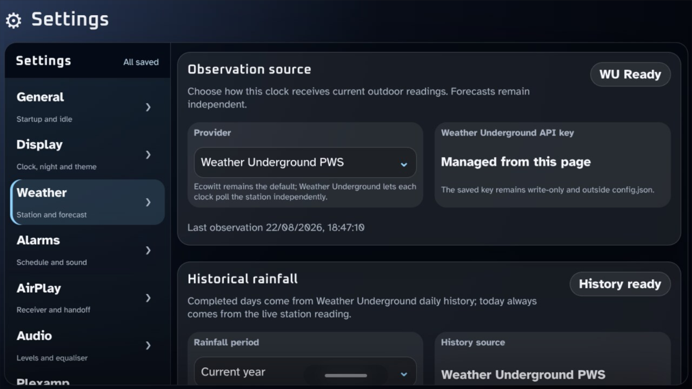

A healthy Weather page then combines cached Open-Meteo forecast data with the configured live observation source:

<table>
<tr>
<td width="50%">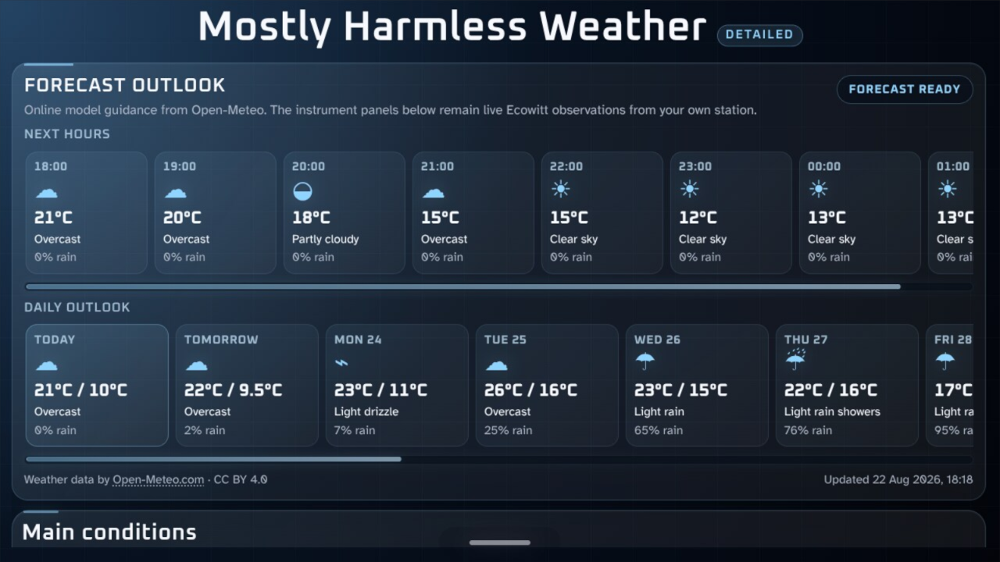</td>
<td width="50%">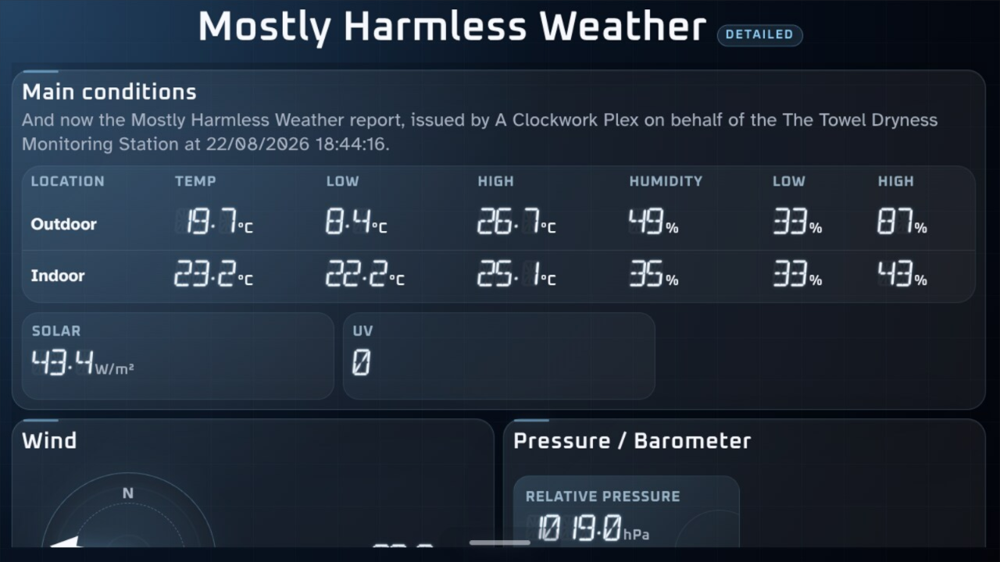</td>
</tr>
<tr>
<td align="center"><sub>Forecast outlook</sub></td>
<td align="center"><sub>Current indoor/outdoor observations</sub></td>
</tr>
</table>

### Music level and EQ

Use **Settings → Audio** for Music Master, source trims, Maximum Alarm Volume and the managed three-band EQ. Remember that the alarm ceiling is deliberately separate from Music Master and music EQ.

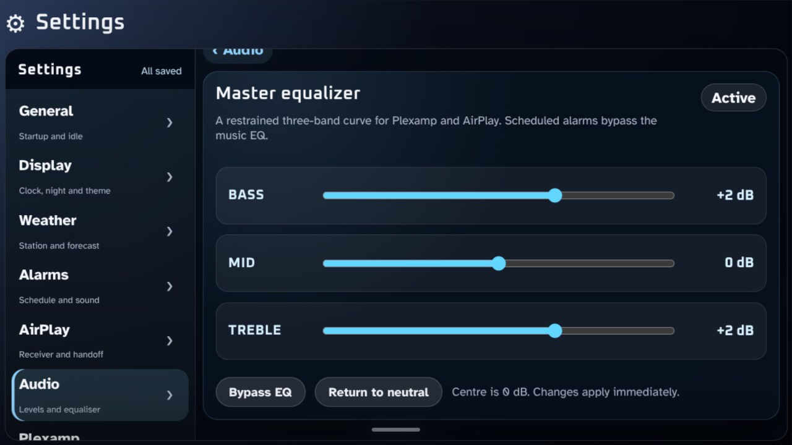

### Your first alarm

Use **Settings → Alarms** to add or edit recurring alarms, select weekdays, tone, target/fade values and the scheduled-audio safety controls.

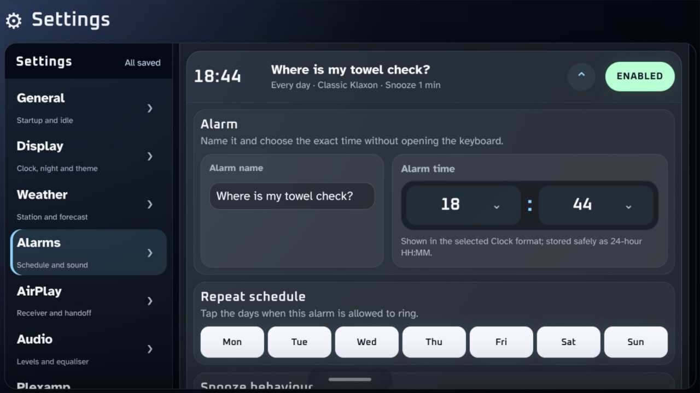

When a real scheduled alarm owns the appliance, the full alarm screen provides Snooze and deliberate slide-to-dismiss controls:

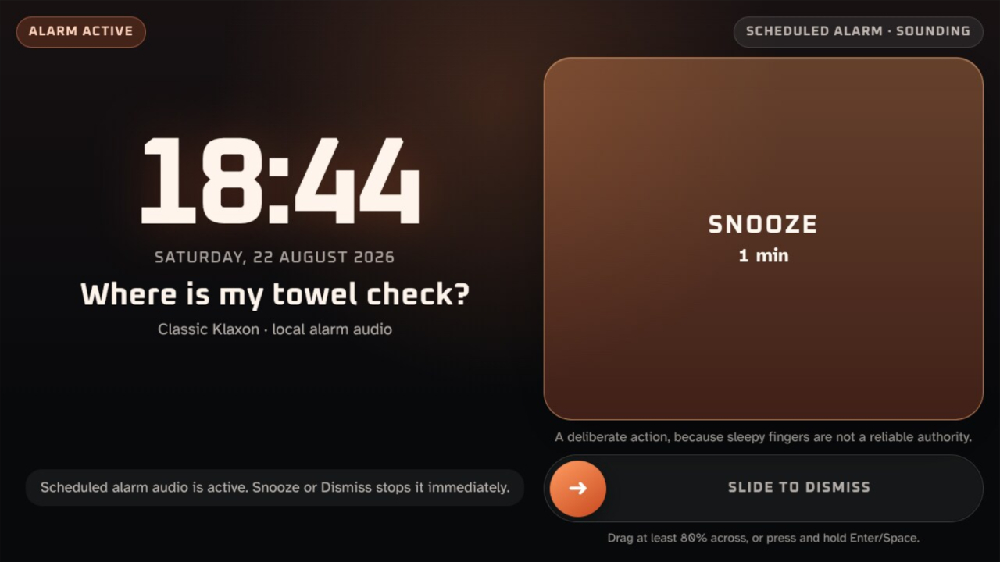

### Normal bedside views

The Clock has distinct daytime and night presentations; night mode is scheduled and touch-to-wake remains available without changing the underlying daytime theme.

<table>
<tr>
<td width="50%">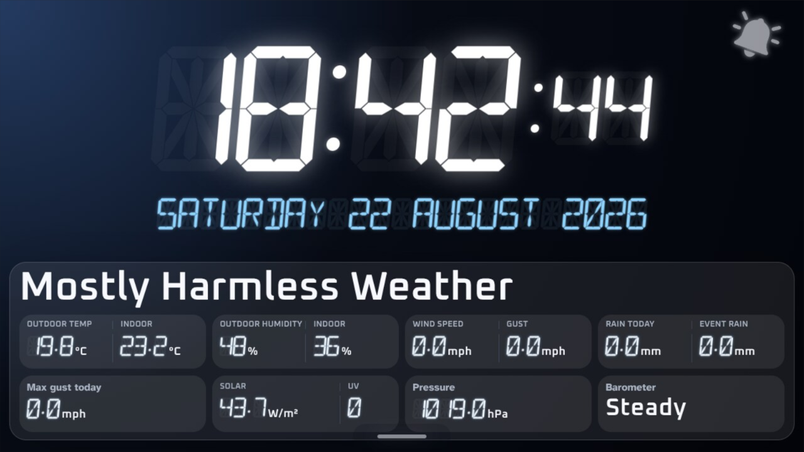</td>
<td width="50%">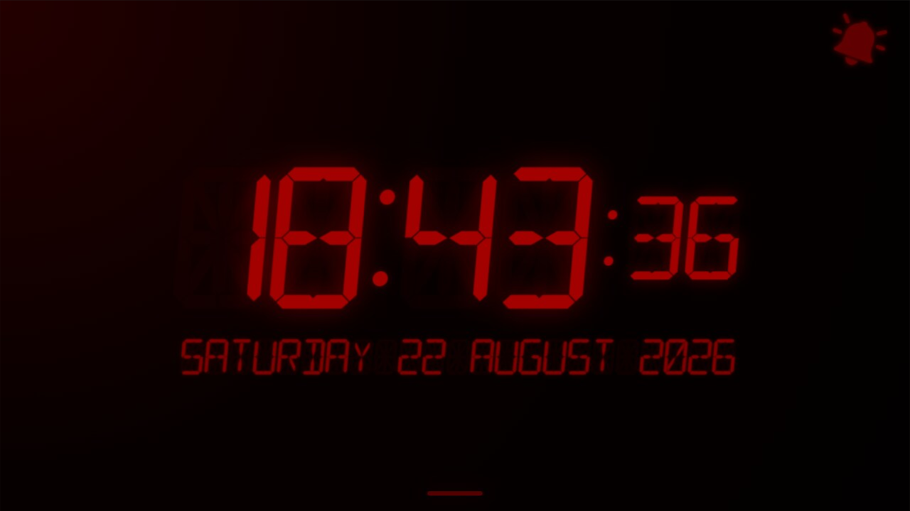</td>
</tr>
<tr>
<td align="center"><sub>Daytime Clock</sub></td>
<td align="center"><sub>Classic night presentation</sub></td>
</tr>
</table>

Plexamp and AirPlay are both normal music sources through the managed music lane. AirPlay shows a ready state before a sender connects and a Now Playing state while audio is active; Plexamp keeps its own familiar player surface inside the appliance kiosk.

<table>
<tr>
<td width="50%">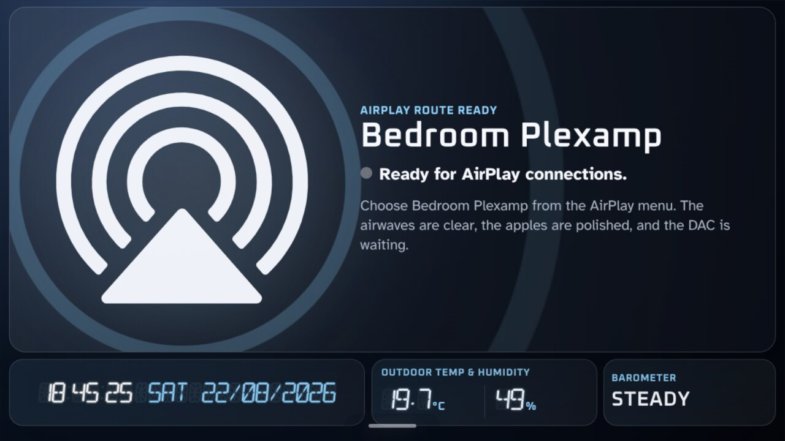</td>
<td width="50%">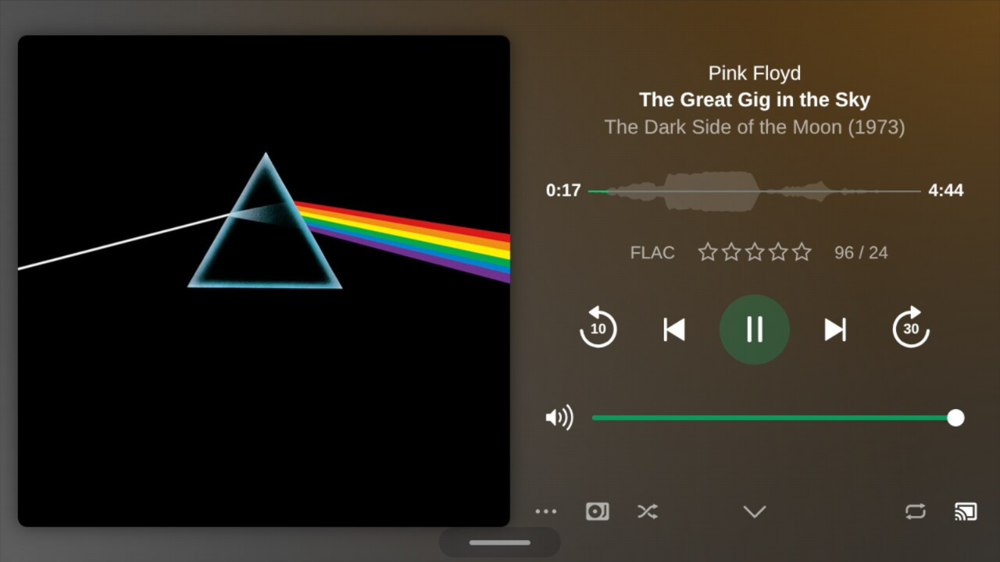</td>
</tr>
<tr>
<td align="center"><sub>AirPlay ready</sub></td>
<td align="center"><sub>Plexamp Now Playing</sub></td>
</tr>
</table>

### About and release identity

**Settings → About** shows the maintained appliance version, release name and matching Git tag identity. For this release it should report **0.4.0 / Unified Bedside Appliance / v0.4.0**.

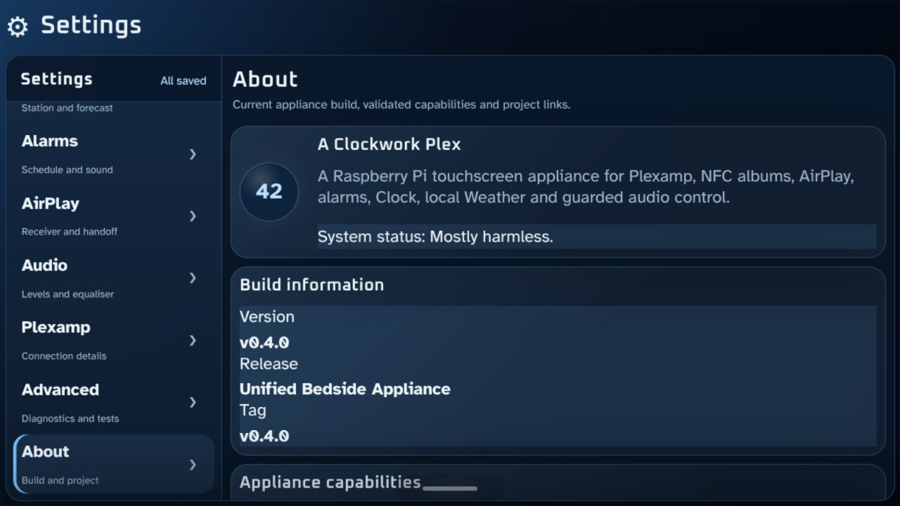

## 9. NFC albums

The installed NFC listener expects the validated PN532 I2C reader on bus 1 at `0x24`. Existing compatible album tags can then trigger Plexamp playback. Tag creation/library workflow is documented separately by the Plexamp NFC project.

## 10. Updating an installed appliance

For the normal `main` update channel:

```bash
cd ~/A-Clockwork-Plex
git status
git switch main
git pull --ff-only
bash setup.sh
```

If `git status` shows unexpected tracked changes, investigate them before pulling rather than forcing the checkout. `setup.sh` rechecks and converges the appliance-owned components after the source update.

If the appliance was intentionally installed from an immutable release tag, do not treat that tag as a branch and blindly pull it. To move to another published release, fetch tags, explicitly select the newer release/tag and follow that release's notes before running setup.

Do not manually rebuild Python environments, audio routes or services component by component.

## Development install

The manual `python3 -m venv`, `pip install -r requirements.txt`, `config.example.json` and `python app/runner.py` workflow is for development only. It is **not** the appliance installation procedure.
